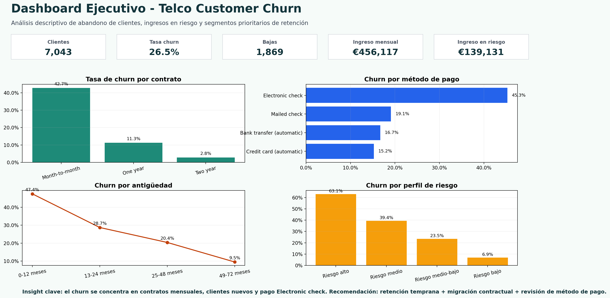

# 📊 Proyecto Dashboard & Análisis de Datos - Telco Customer Churn

## 📖 Descripción del proyecto

Este proyecto desarrolla un análisis exploratorio de datos (EDA) sobre el abandono de clientes de una empresa de telecomunicaciones ficticia. El objetivo es limpiar, transformar y analizar los datos para construir un dashboard ejecutivo que permita identificar los segmentos con mayor riesgo de baja y proponer acciones de retención basadas en evidencias.

El trabajo se ha realizado siguiendo la lógica del módulo **Dashboard & Análisis de Datos**: comprensión del dataset, identificación de variables, transformación y limpieza, análisis descriptivo, identificación de patrones/anomalías, visualización mediante dashboard e informe explicativo.

## 🎯 Objetivos

- Analizar un dataset con más de 2.000 filas y más de 10 columnas.
- Limpiar y transformar datos para dejarlos preparados para análisis.
- Crear variables derivadas útiles para segmentación y decisión de negocio.
- Construir un dashboard con KPIs, gráficos y lectura ejecutiva.
- Redactar conclusiones y recomendaciones accionables.

## 🗂️ Estructura del repositorio

```text
Proyecto-Telco-Churn-Dashboard/
├── README.md
├── data/
│   ├── raw/
│   │   └── Telco-Customer-Churn.csv
│   └── processed/
│       ├── telco_customer_churn_limpio.csv
│       ├── analisis_por_contrato.csv
│       ├── analisis_por_pago.csv
│       └── analisis_por_perfil_riesgo.csv
├── dashboard/
│   └── proyecto_telco_churn_dashboard_10.xlsx
├── docs/
│   ├── informe_telco_churn_dashboard_10.docx
│   └── informe_telco_churn_dashboard_10.pdf
├── images/
│   └── dashboard_preview.png
└── resources/
    └── fuentes_y_metodologia.txt
```

## 🧾 Fuente de datos

Dataset utilizado: **Telco Customer Churn**, sample data de IBM Cognos Analytics.

- Fuente IBM: https://www.ibm.com/docs/en/cognos-analytics/12.0.x?topic=samples-telco-customer-churn
- Espejo Kaggle: https://www.kaggle.com/datasets/blastchar/telco-customer-churn

El dataset contiene **7,043 clientes** y **21 columnas originales**. Cada fila representa un cliente y la variable `Churn` indica si el cliente abandonó la compañía.

## 🧹 Transformación y limpieza de datos

Principales acciones realizadas:

- Conversión de `TotalCharges` a formato numérico.
- Imputación de 11 valores vacíos de `TotalCharges` a 0, al corresponder con clientes con `tenure = 0`.
- Verificación de duplicados exactos: 0 duplicados.
- Estandarización de variables categóricas.
- Creación de variables derivadas:
  - `ChurnFlag`
  - `ClienteActivo`
  - `TenureGroup`
  - `MonthlyChargeGroup`
  - `RevenueRisk`
  - `NumServices`
  - `AvgMonthlyPerService`
  - `CustomerValueSegment`
  - `ChurnRiskProfile`

## 📊 Dashboard

El dashboard incluye:

- Total de clientes.
- Tasa global de churn.
- Ingresos mensuales totales.
- Ingreso mensual en riesgo.
- Ticket medio mensual.
- Bajas totales.
- Churn por contrato.
- Churn por método de pago.
- Churn por antigüedad.
- Distribución por servicio de internet.
- Ranking de perfiles de riesgo.



## 📌 Resultados principales

- Clientes analizados: **7,043**.
- Tasa global de churn: **26.5%**.
- Clientes que abandonaron: **1,869**.
- Ingreso mensual total: **€456,116.60**.
- Ingreso mensual asociado a clientes con baja: **€139,130.85**.

## ✅ Conclusiones

1. El churn se concentra especialmente en clientes con contrato mensual.
2. El método de pago `Electronic check` aparece como segmento relevante de riesgo.
3. La antigüedad es clave: los clientes nuevos presentan más propensión a abandonar.
4. Las acciones de retención deben priorizar segmentos de alto riesgo y alto impacto económico.

## 🔄 Próximos pasos

- Crear un modelo predictivo de churn.
- Incorporar datos de campañas comerciales y atención al cliente.
- Comparar la tasa de churn antes y después de las acciones de retención.
- Automatizar el dashboard en Google Sheets o Power BI.

## 🛠️ Herramientas utilizadas

- Excel / Google Sheets.
- Tablas dinámicas y gráficos.
- Funciones equivalentes a Google Sheets: `SUMA`, `CONTAR.SI`, `PROMEDIO.SI`, `SI`, `SI.ERROR`, `SUMAR.SI.CONJUNTO`, `FILTER`, `UNICOS`.
- Análisis Exploratorio de Datos (EDA).

## ✒️ Autora

Irene Muñoz  
Proyecto final del módulo **Dashboard & Análisis de Datos**.
